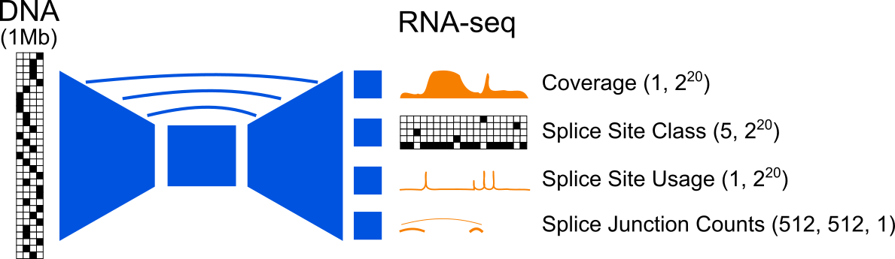
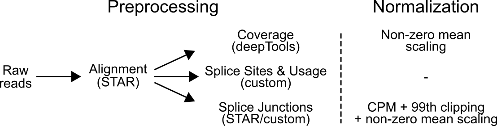
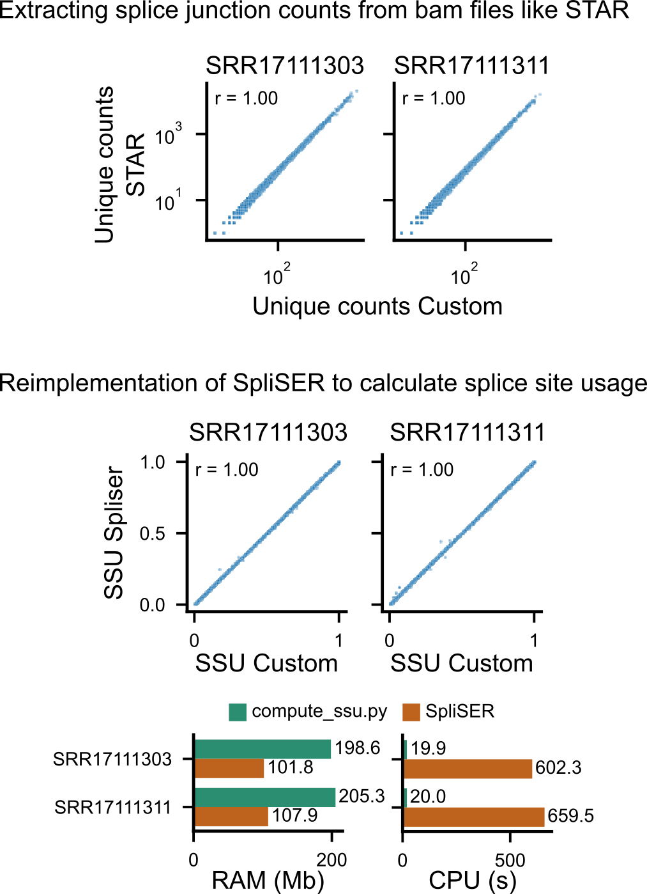
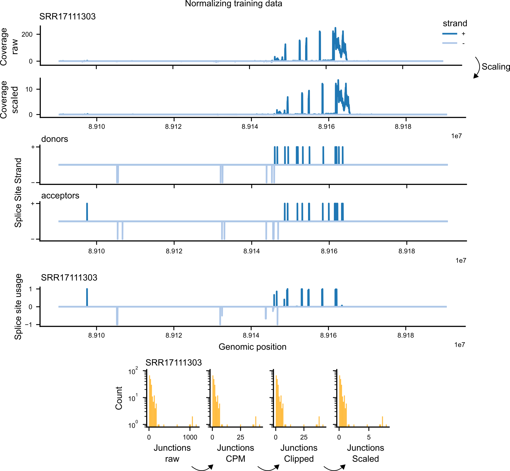
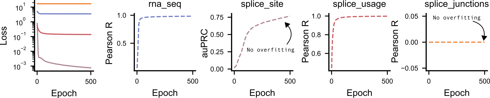
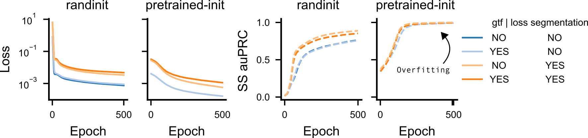
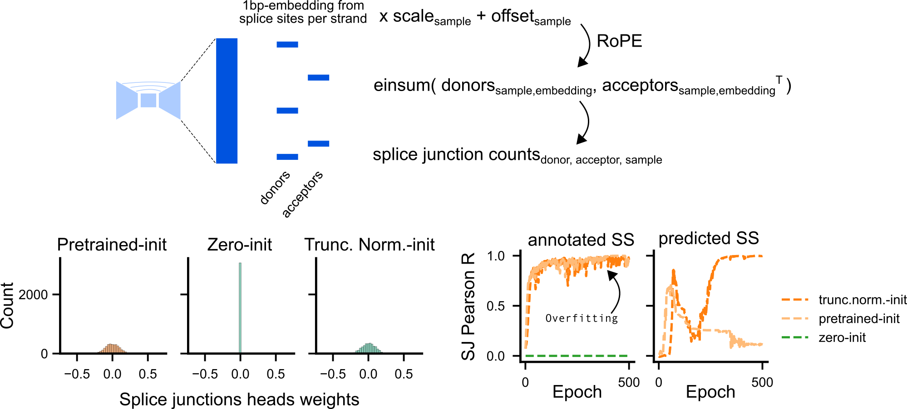
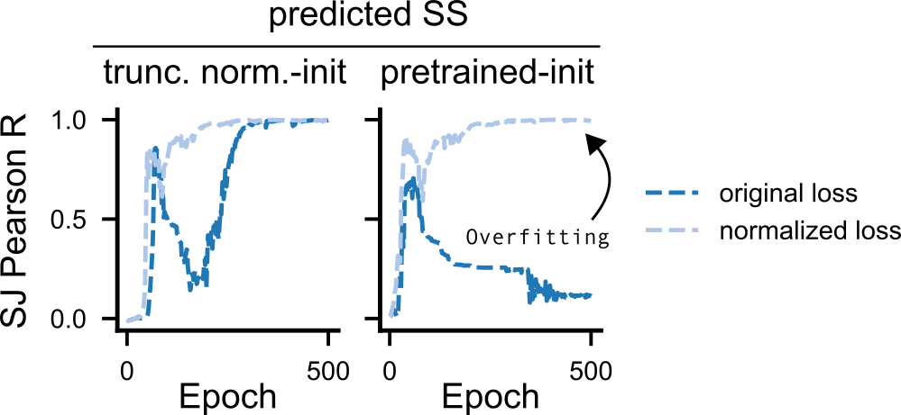


DeepMind has released [AlphaGenome](https://deepmind.google/discover/blog/alphagenome-a-foundation-model-for-genome-biology/)’s code and model weights, along with examples for fine-tuning on bigwig-based modalities such as RNA sequencing (RNA-seq) coverage tracks.

Other RNA-seq-derived outputs, including splice site probabilities, splice site usage, and splice junctions, require additional implementation, from data preprocessing and loading to testing fine-tuning on unseen samples. What initially seemed like a straightforward extension became a useful exercise in understanding how large genomic models learn and how to debug new output heads.

In this post, we share that development process: preprocessing the data, building loaders, running sanity checks, and overfitting a single interval, including the bugs we found along the way and how we fixed them.

For this fine-tuning example, we chose two RNA-seq samples from López-Oreja (2023): one carrying the SF3B1 K700E cancer driver mutation and one without it. This mutation is known to promote the recognition of cryptic splice sites, so we expected it to affect the RNA-seq modalities considered here. In this blogpost we only use these data for code development purposes of multimodal learning, but we will delve into the sequence determinants of this misregulated modulation in the next blogpost on this topic.

All code, model adaptations, and pipelines used for this blog post are available.



---

## From raw data to preprocessed training tracks

AlphaGenome's preprocessing code is not publicly available, though the key steps are described in the paper's methods. To reproduce the pipeline as closely as possible, we wrote standardized scripts that derive all four training tracks from a single STAR RNA-seq alignment BAM file. Reads are aligned with STAR following the AlphaGenome paper's alignment settings, retaining only uniquely mapped reads on canonical chromosomes.

- **Per-base RNA-seq coverage** (stranded or unstranded) is computed using [deepTools']() `bamCoverage`. Output: bigwig files.
- **Splice site classes** are derived on the fly during data loading from the union of splice sites present in the splice site usage files, so no separate file is needed.
- **Splice site usage** is computed from the BAM using our custom script `compute_ssu.py`, equivalent to [`SpliSER`](). For each splice site supported by at least one junction, usage is estimated as the fraction of reads supporting that site relative to reads that skip it. Output: zstd-compressed parquet files.
- **Splice junction counts** are available directly from STAR at alignment time, or can be extracted post-hoc from the BAM using our custom script `get_star_junctions.py`. Output: tab-separated files.

To make sure our custom implementations to compute splice junction counts and splice site usage matched how STAR and SpliSER calculate them respectively, we ran a comparison on chromosome 1 on our samples.

In both cases we observe a Pearson correlation of 1 (for splice junction counts from uniquely mapped reads and for splice site usage), confirming the implementations are correct.

Both implementations were also highly efficient in runtime, with `get_star_junctions.py` requiring ~10s and ~150 MB per sample, and `compute_ssu.py` requiring ~20s and ~200 MB per sample compared to SpliSER's ~600s and ~100 MB.

## Data loading and on-the-fly normalization

All four tracks are loaded jointly for each genomic interval and normalized on the fly before being passed to the model. Getting this right matters: RNA-seq coverage spans several orders of magnitude across genes and samples, splice junction counts are extremely sparse, and splice site labels are binary signals at a handful of positions in a million-base-pair window. Each modality needs a different normalization strategy to avoid one dominating the loss or presenting the model with uninformative targets.

**RNA-seq coverage** bigwigs are read at 1 bp resolution and binned by summation to the model's output resolution. The raw values are loaded as-is; normalization happens at training time. Just before the loss is computed, targets are scaled into model prediction space by dividing by a per-track non-zero mean (computed once from the training set), applying a power transform (x^0.75) to compress dynamic range, and smooth-clipping extreme values. Model predictions are converted back to data space using the inverse of these operations for evaluation.

**Splice site classes** are derived on the fly as a 5-class label array: donor on the positive strand, acceptor on the positive strand, donor on the negative strand, acceptor on the negative strand, and background. All positions default to background, and annotated splice sites from the union of sites in the splice site usage files are then overlaid.

**Splice site usage** values are loaded from the precomputed parquet files. For each genomic interval, only the splice sites overlapping that interval are retrieved, and usage values are arranged into a per-position array with two channels per sample (one per strand).

**Splice junction counts** from STAR are CPM-normalized using the total mapped reads per sample, clipped at the 99.99th percentile, and then mean-scaled so that the typical non-zero value is close to 1. Junctions are assembled into a donor × acceptor count matrix, with forward and reverse strand channels interleaved across samples.

## First time never works

As a first sanity check, we verified that the model could overfit a single genomic interval using linear probing (freezing the backbone and training only the new heads). A model with enough capacity should memorize a single batch; failure to do so points to a bug rather than a generalization problem. To make the test representative, we selected an interval with median splice junction density among all training intervals (see [this]() notebook for the selection details).

The test was useful precisely because it failed. The splice site probability heads did not overfit, and the splice junction heads did not learn at all. The next two sections trace what was wrong with each and how we fixed it.

## Initializing splice site heads with pretrained weights facilitates single-batch overfitting

The splice site classification head struggled to overfit when initialized randomly. This is not surprising: the purpose of fine-tuning AlphaGenome is not to re-learn the general splicing code from scratch. The splice site classification head captures a property shared across all samples, where donor and acceptor sites sit on each strand, while the splice site usage and junction heads carry the sample-specific signal. It therefore makes sense to start from the pretrained weights for this head and let the sample-specific heads adapt.

We explored three factors that could affect overfitting on the single interval: (1) initializing the splice site classification head from pretrained rather than random weights (see [this]() notebook for how we select which pretrained tracks to use for initialization), (2) augmenting the interval's splice sites with all annotated sites from the GTF (to reduce label sparsity, since AlphaGenome was pretrained on many more samples and thus more splice sites), and (3) segmenting the loss computation to match the 8-segment sequence parallelism used during AlphaGenome pretraining. We implemented support for all three options via `finetune.py` flags: `--pretrained-head-samples` to initialize specific head weights from a pretrained track (e.g. `splice_site:0`), `--gtf` to supply a GTF or parquet file of canonical splice sites, and `--num-segments` to control how many segments the sequence is split into for loss computation (applies to all modalities, not just splicing).

Initializing from pretrained weights enabled clean overfitting regardless of whether GTF sites or loss segmentation were used. When starting from random weights, loss segmentation had a secondary effect: higher overall loss but faster overfitting, with or without the GTF augmentation.

## Why the junction head could not learn

After fixing the loss bugs, the splice junction head still would not learn. Understanding why required looking at how the head works. For each genomic interval, the trunk produces 1 bp resolution embeddings across the full sequence. The junction head extracts embeddings only at the positions of known splice sites (up to 512; padded with -1 if fewer are present). Each extracted embedding is then linearly transformed with a learned per-sample scale and offset before RoPE positional encoding is applied. Junction counts for each donor-acceptor pair are then predicted as the softplus of the inner product between the corresponding donor and acceptor embeddings.

Inspecting the pretrained weights revealed the problem: the scale and offset parameters were initialized to zeros. With scale=0 and offset=0, the transformation `scale * x + offset` collapses every embedding to zero before RoPE, blocking any gradient from flowing back through those parameters. The pretrained weights for these parameters follow a truncated normal distribution, not zeros, so a randomly initialized head would be stuck from the very first step.

Cross-referencing with the original JAX implementation and reaching out to the authors (see [GitHub issue]()) confirmed this was a bug also in the original implementation. The fix was to initialize `rope_params` with a truncated normal distribution (std=0.1), controlled via the `--rope-init` flag in `finetune.py` (default: `truncated_normal`; `zeros` is kept only for ablation experiments).

With the fix in place, the randomly initialized junction head overfits successfully when splice site positions are taken from the target junctions, set via `--junction-position-source annotated` (the default). 

Using predicted positions (`--junction-position-source predicted`) exposed a further issue: pretrained-weight initialization collapsed while random initialization still learned. The pretrained head was optimized alongside a dense, tissue-diverse set of splice site positions from pretraining; positions predicted by a freshly fine-tuned splice site head on just two samples are sparser and differently distributed, likely placing it outside its operating range. Looking at the loss values pointed to a related problem — the junction cross-entropy was going negative during training, which would destabilize any head but hit the pretrained one harder.

The root cause is a mismatch between the paper's pseudocode and both the JAX and PyTorch implementations. The supplementary methods define `multinomial_cross_entropy` by normalizing both targets and predictions to ratios before computing the cross-entropy, so `log(p_pred) <= 0` always and the loss is guaranteed non-negative. The JAX implementation instead uses a log-normalizer formulation (`log_normalizer - log_likelihood`), which is mathematically equivalent when junction counts are present but produces a negative contribution when a training window contains annotated splice sites with zero observed counts — common in sparse datasets like SF3B1 RNA-seq, where not every annotated site will have reads in a given sample. The PyTorch port (`--junction-loss original`, the default) inherited this behavior unchanged.

We opened a GitHub issue with the authors, who confirmed the discrepancy and introduced a ratio-normalized formulation: both targets and predictions are divided by their within-mask sums before computing `-p_true * log(p_pred)`. We ported this as `--junction-loss normalized`. Since `p_pred <= 1`, its log is always non-positive and the loss is always non-negative. With this correction, training is stable, the loss no longer dips below zero on sparse windows, and both random and pretrained-weight initialization can overfit the single interval regardless of whether annotated or predicted splice site positions are used.

## Limitations

All debugging was performed on a single genomic interval with just two RNA-seq samples, so the behavior we observed may not generalize to larger or more diverse training sets. The preprocessing pipeline reproduces the main steps described in the AlphaGenome paper, but since the original code is not public, we cannot guarantee exact parity.

This post focuses entirely on getting the implementation correct, not on biological results. We do not report held-out performance or compare model predictions to independent data. Whether the fine-tuned heads generalize to unseen genomic intervals or samples, and whether they capture SF3B1-specific splicing changes, is left for the follow-up post.

## Conclusion

This process gave us a much better understanding of what it actually takes to fine-tune new transcriptomic heads on AlphaGenome. Extending the model to splicing modalities was not simply a matter of adding data loaders and output layers: label sparsity, head initialization, loss formulation, and the interaction between position sources and weight initialization all turned out to matter.

The most useful strategy was to build confidence at each step before scaling up, from preprocessing validation and target inspection, through single-interval overfitting, to multi-GPU training. Each stage exposed a different class of problem. The single-interval test in particular was worth its weight as the two loss bugs and a zero-initialization bug in the junction head would have been much harder to diagnose in a full training run. We hope that sharing these intermediate failures, alongside the fixes and the flags that control them, makes it easier for others to extend AlphaGenome to new RNA-seq modalities and biological questions. 

In the end, this project became more than a simple port. It resulted in reusable preprocessing scripts, training pipelines, and a set of practical checks and warnings that we hope make fine-tuning RNA-seq–derived splicing modalities on AlphaGenome more transparent and reproducible. We are especially grateful to the DeepMind developers for openly sharing their code and model weights, and for their responsiveness when we reported bugs and implementation issues; their feedback was instrumental in reaching the conclusions presented here. We hope these efforts help make fine-tuning splicing heads as seamless and accessible as possible for the broader community.

## Reproducibility

The repository [alphagenome_finetuning_rna]() contains all the necessary code, from data downloading to analysis and figures, to reproduce these results.

## Acknowledgements

Thanks to the [Genomics x AI](https://genomicsxai.github.io/) community and the Kundaje Lab at Stanford, where the AlphaGenome PyTorch port is developed. We acknowledge the EuroHPC Joint Undertaking for awarding this project access to the EuroHPC supercomputer MareNostrum 5, hosted by the Barcelona Supercomputing Center (Spain) through an EuroHPC Development Access call. We acknowledge support of the Spanish Ministry of Science and Innovation through the Centro de Excelencia Severo Ochoa (CEX2020-001049-S, MCIN/AEI /10.13039/501100011033), and the Generalitat de Catalunya through the CERCA programme, and to the EMBL partnership. We are grateful to the CRG Core Technologies Programme for their support and assistance in this work.
